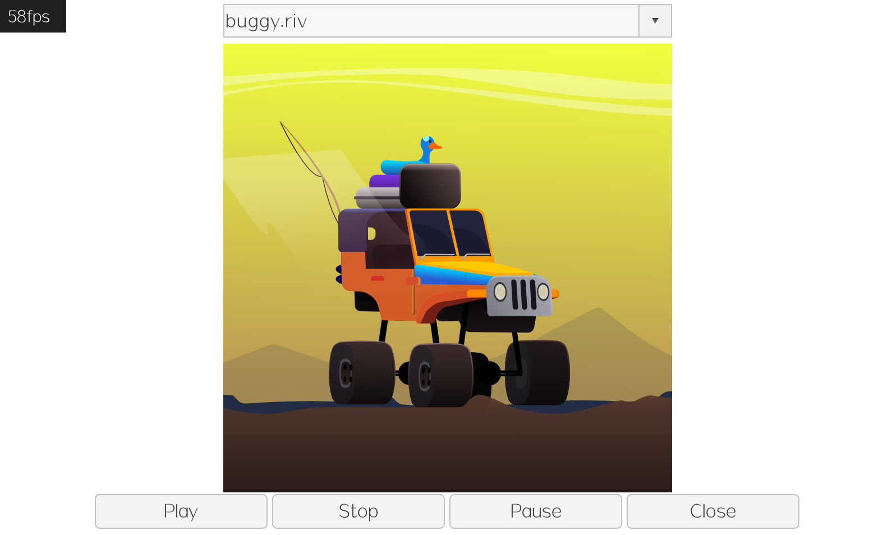

# awtk-widget-rive

[Rive](https://rive.app/) 是一个超级强大的动画格式及配套工具。[rive player](https://github.com/zlgopen/awtk-widget-rive) 控件是基于 [rive-cpp](https://github.com/rive-app/rive-cpp) 实现的 [Rive](https://rive.app/) 播放器。



## 准备

1. 获取 awtk 并编译

```
git clone https://github.com/zlgopen/awtk.git
cd awtk; scons; cd -
```

2. 获取 awtk-widget-rive 并编译 

```
git clone https://github.com/zlgopen/awtk-widget-rive
cd awtk-widget-rive
git clone https://github.com/rive-app/rive-cpp src/rive-cpp
scons
```

## 运行

* 1. 生成示例代码的资源

```
python scripts/update_res.py all
```
> 也可以使用 Designer 打开项目，之后点击 “打包” 按钮进行生成；
> 如果资源发生修改，则需要重新生成资源。

如果 PIL 没有安装，执行上述脚本可能会出现如下错误：
```cmd
Traceback (most recent call last):
...
ModuleNotFoundError: No module named 'PIL'
```
请用 pip 安装：
```cmd
pip install Pillow
```

2. 编译

* 编译 PC 版本

```
scons
```

* 编译 LINUX FB 版本

```
scons LINUX_FB=true
```

> 完整编译选项请参考 [编译选项](https://github.com/zlgopen/awtk-widget-generator/blob/master/docs/build_options.md)

3. 运行

```
./bin/demo
```

## 文档

* 在 XML 创建的方法

```xml
  <rive x="c" y="m" w="600" h="400" name="rive" url="heart.riv"/>
```

* [完善自定义控件](https://github.com/zlgopen/awtk-widget-generator/blob/master/docs/improve_generated_widget.md)

## 已知问题

* 请使用 cairo 作为 vgcanvas 的 backend 获得完整功能演示，其它 backend 由于不支持 clip path 和多个 stop 的渐变色，可能存在潜在的问题。

修改 awtk/awtk_config.py，并重新编译：

```
VGCANVAS='CAIRO'
```

